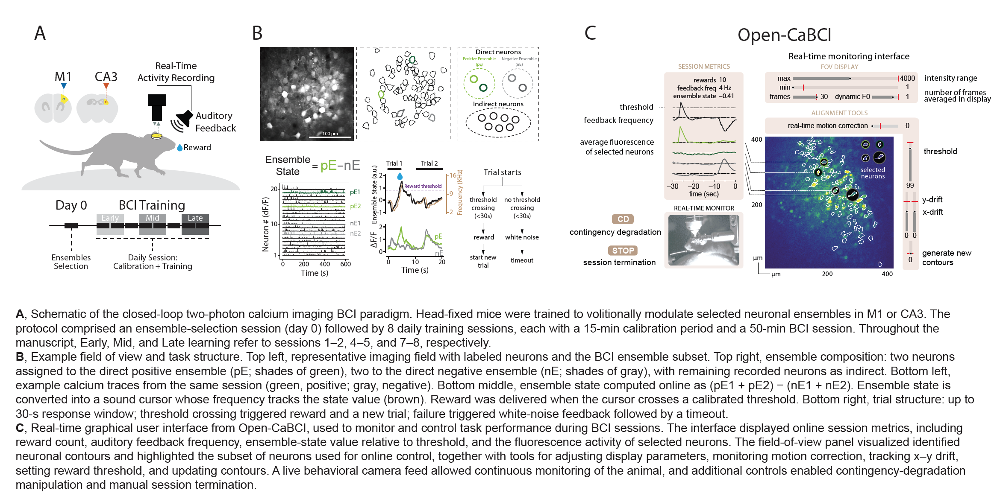

# Open-CaBCI

**A real-time, closed-loop two-photon calcium imaging brain-computer interface for volitional ensemble control.**

Open-CaBCI records calcium-imaging frames, extracts activity from selected neuronal ensembles, computes an online ensemble state, maps that state to auditory feedback, and triggers reward delivery. This repository contains the Python source code and a five-minute hardware-free demonstration dataset.

## Associated Publication

**[Equivalent volitional learning emerges through circuit-specific population dynamics in motor cortex and hippocampus](https://www.biorxiv.org/content/10.64898/2026.06.04.730137v1)**

Andres de Vicente\*, Catalin Mitelut\*, Renan Viana Mendes, Lorenzo Marianelli, Mariona Colomer Rosell, David Bruckner, Giampiero Bardella, and Flavio Donato

\*Equal contribution | Correspondence: flavio.donato@unibas.ch

bioRxiv 2026.06.04.730137 | DOI: [10.64898/2026.06.04.730137](https://doi.org/10.64898/2026.06.04.730137)

## Contents

- [Paradigm overview](#paradigm-overview)
- [System requirements](#system-requirements)
- [Installation](#installation)
- [Five-minute demo](#five-minute-demo)
- [Using your own data](#using-your-own-data)
- [Algorithm overview](#algorithm-overview)
- [Reproducing manuscript results](#reproducing-manuscript-results)
- [Repository structure](#repository-structure)
- [License and citation](#license-and-citation)

## Paradigm Overview



**(A)** Head-fixed mice learn to modulate selected neuronal ensembles in M1 or CA3. The protocol comprises an ensemble-selection session (day 0), followed by daily calibration and BCI sessions.

**(B)** Online calcium signals from two ensembles are converted into an ensemble-difference state that controls an auditory cursor. Crossing the calibrated threshold triggers reward and a lockout period.

**(C)** The live interface displays ROI traces, the calcium field of view, ensemble state, threshold, reward events, and motion-correction controls.

## System Requirements

### Tested configuration

The bundled demo was tested on:

- Open-CaBCI 0.1
- Ubuntu 22.04.5 LTS, x86-64
- Python 3.9.13
- A standard desktop CPU; no GPU is required
- 8 GB RAM or more
- Approximately 12 GB free disk space during the first run: about 3.1 GB of compressed demo files, Git object storage, and a generated 4.7 GB raw movie
- An X11 display and Tk support for the optional live GUI

The hardware-free command-line demo should also work on other modern Linux distributions with Python 3.9. The GUI and acquisition pipeline have not been validated for this release on macOS or Windows.

### Tested Python dependencies

Exact tested versions are recorded in `requirements.txt`:

| Dependency | Tested version |
|---|---:|
| NumPy | 1.24.4 |
| pandas | 1.4.4 |
| Matplotlib | 3.5.2 |
| SciPy | 1.9.1 |
| scikit-learn | 1.6.1 |
| scikit-image | 0.19.2 |
| OpenCV Python | 4.7.0.72 |
| tqdm | 4.64.1 |
| parmap | 1.6.0 |
| NetworkX | 2.8.4 |
| openpyxl | 3.0.10 |

On Ubuntu, the live GUI additionally requires Tk:

```bash
sudo apt-get update
sudo apt-get install python3-tk
```

### Hardware requirements

No non-standard hardware is required for the bundled demo.

The real acquisition workflow is designed for:

- A two-photon microscope writing 512 × 512, 16-bit raw calcium frames
- Microscope frame TTL input to an NI-DAQ device
- NI-DAQ analog output for auditory feedback and water-valve control
- A Basler-compatible camera accessed through `pypylon`
- Speaker, water valve, lick detector, and optional microphone/rotary encoders

The current laboratory configuration uses NI-DAQ channels addressed as `Dev3`. Real-hardware operation therefore requires local channel configuration and the optional `nidaqmx`, `pypylon`, and `pyaudio` packages. These hardware packages are intentionally not required by the demo.

## Installation

Clone the public repository and create an isolated environment:

```bash
git clone https://github.com/donatolab/Open-CaBCI.git
cd Open-CaBCI

python3 -m venv .venv
source .venv/bin/activate
python -m pip install --upgrade pip
python -m pip install -r requirements.txt
```

Installation normally takes 3–5 minutes on a recent desktop with a broadband connection, excluding the time needed to clone the approximately 3.1 GB demonstration dataset.

## Five-Minute Demo

The bundled dataset contains 9,000 consecutive, real calcium-imaging frames at 30 Hz, matching ROI calibration metadata, a day-0 mask, and a simulated TTL waveform. The movie is split into 90 gzip files of approximately 35 MB so every Git object remains below GitHub's 100 MB file limit.

Dataset details and checksums are in `openbmi/data_samples/demo_5min/README.md`.

### Fast validation

Run all 9,000 frames as quickly as the computer permits:

```bash
python run_demo.py
```

On the first run, the command reconstructs `Image_001_001.raw`, validates all inputs, executes the BMI pipeline, saves outputs, and validates those outputs. The measured first-run time on the tested workstation was approximately 50 seconds; allow 1–2 minutes on a normal desktop. Later runs skip reconstruction and are faster.

Expected final output:

```text
Validated 9000 processed frames
ROI ranges: E1=340.542..1241.764, E2=346.180..2068.367
Simulation output: .../demo_5min/data/results.npz
```

Generated files:

- `openbmi/data_samples/demo_5min/data/results.npz`: complete numerical simulation output
- `openbmi/data_samples/demo_5min/data/results.xlsx`: per-frame state table
- `openbmi/data_samples/demo_5min/data/Image_001_001.raw`: reconstructed 4.7 GB movie cache

Generated files are ignored by Git and can be deleted safely; the next run reconstructs the movie from the compressed chunks.

### Realtime GUI

Replay the full five-minute recording at its original 30 Hz rate while displaying the live interface:

```bash
python run_demo.py --gui --realtime
```

Expected behavior:

- A Matplotlib/Tk window opens after approximately two seconds.
- Calcium images and ROI traces update continuously.
- The ensemble state and reward threshold are displayed.
- The simulation processes 9,000 frames over 300 seconds.
- Results are saved and validated when the window closes at the end of the run.

Expected total runtime is approximately 5–6 minutes, including GUI startup and output saving. The measured runtime on the tested workstation was 304.5 seconds.

For a shorter smoke test, process only the first 1,000 frames without the GUI:

```bash
python run_demo.py --frames 1000
```

## Using Your Own Data

### Hardware-free replay

Prepare a directory with this layout:

```text
my_session/
├── data/
│   └── Image_001_001.raw
├── rois_pixels_and_thresholds.npz
└── ttl_pulses.npy
```

Requirements:

- `Image_001_001.raw` must contain contiguous 512 × 512 `uint16` frames.
- `rois_pixels_and_thresholds.npz` must be produced by the current calibration workflow and contain both ensemble footprints, ensemble baselines, contours, thresholds, frequencies, and `calibration_template`.
- `ttl_pulses.npy` must contain a voltage trace with falling edges marking completed microscope frames.

Run the replay with:

```bash
python run_demo.py --dataset /absolute/path/to/my_session --frames 9000
```

Add `--gui --realtime` to display and pace the replay at 30 Hz.

### Real acquisition hardware

After installing and configuring the hardware-specific libraries and NI-DAQ channel names:

```bash
cd openbmi
python bmi_gui.py
```

Select the session root, disable the relevant simulation flags, and confirm frame count, camera dimensions, reward pulse duration, and motion-correction settings before starting. Real-hardware operation must be validated locally with the microscope disconnected from the animal before an experimental session.

## Algorithm Overview

The core online procedure is implemented in `openbmi/bmi/bmi.py`; calibration metadata is produced by `openbmi/calibration/CalibrationTools.py`; the live display is implemented in `openbmi/plotter/plotter.py`.

```text
load calibrated ROI footprints, baseline fluorescence, and reward threshold
initialize shared state for plots, tone, reward, motion, and termination
initialize microscope TTL input, or recorded TTL input in simulation mode

for each detected falling TTL edge:
    identify the corresponding 512 × 512 calcium frame
    optionally estimate and apply image drift correction
    extract mean fluorescence from every ensemble ROI
    convert ROI fluorescence to baseline-normalized activity
    temporally bin and smooth each ROI trace
    sum ROI activity separately within ensemble 1 and ensemble 2
    ensemble_state = ensemble_1_activity - ensemble_2_activity
    map ensemble_state to auditory cursor frequency

    if ensemble_state crosses the calibrated reward threshold:
        trigger reward
        enter static and activity-dependent reward lockout
    else if the trial exceeds its time limit:
        signal a missed trial and enter lockout

    publish the frame, traces, state, threshold, and reward events to the GUI
    append per-frame values and timestamps to the session record

save numerical results and the per-frame state table
```

For the manuscript checklist, this detailed code-functionality description is provided **elsewhere: in this README's Algorithm Overview and the linked source files**.

## Reproducing Manuscript Results

The repository includes analysis workflows under `openbmi/analysis/`, including behavior, calcium, alignment, and legacy notebooks. The compact demonstration dataset validates online execution but is not sufficient to reproduce cohort-level quantitative results from the manuscript. Full reproduction requires the study datasets and session metadata described in the publication. Contact the corresponding author regarding access and the appropriate analysis entry point.

## Repository Structure

```text
Open-CaBCI/
├── figures/                         README figures
├── openbmi/
│   ├── analysis/                    offline analysis notebooks and utilities
│   ├── bmi/                         online BMI state computation
│   ├── calibration/                 ROI and threshold calibration
│   ├── camera/, tone/, water/       hardware-facing modules
│   ├── plotter/                     live graphical interface
│   ├── simulation/                  recorded TTL simulation
│   └── data_samples/demo_5min/      bundled five-minute dataset
├── run_demo.py                      validated hardware-free entry point
├── requirements.txt                 tested Python dependencies
├── setup.py                         package metadata
└── LICENSE                          GPL-3.0 license text
```

## License and Citation

Open-CaBCI is distributed under the OSI-approved [GNU General Public License v3.0](LICENSE). You may use, modify, and redistribute the software under the terms of that license.

Public source repository: [github.com/donatolab/Open-CaBCI](https://github.com/donatolab/Open-CaBCI)

If you use Open-CaBCI, please cite the associated publication listed above.

This project builds on tools originally developed by **Catalin Mitelut** ([@catubc](https://github.com/catubc/bmi_tools)).

**Donato Lab** | Biozentrum, University of Basel<br>
[donatolab.com](https://donatolab.com) | flavio.donato@unibas.ch
